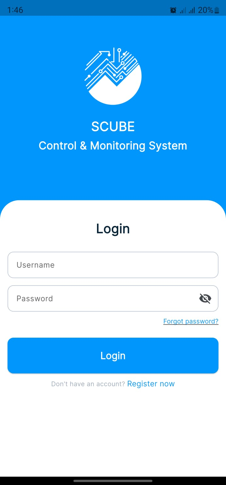
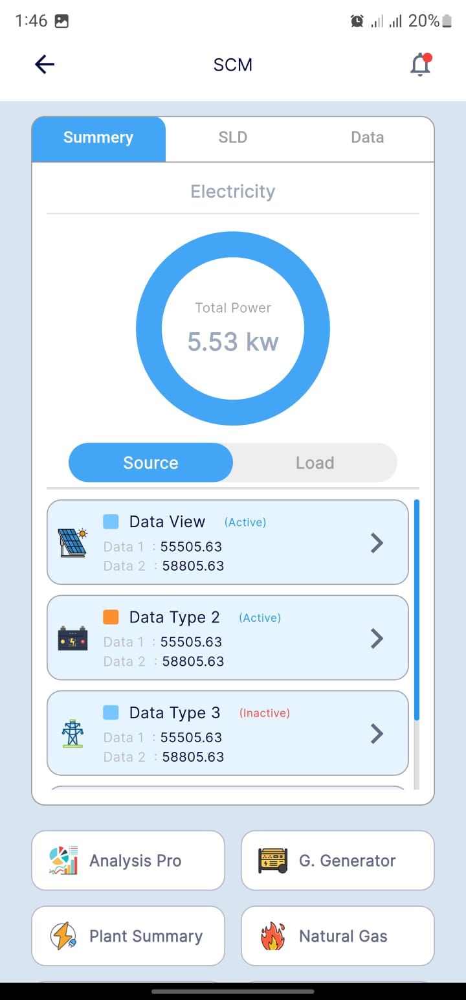
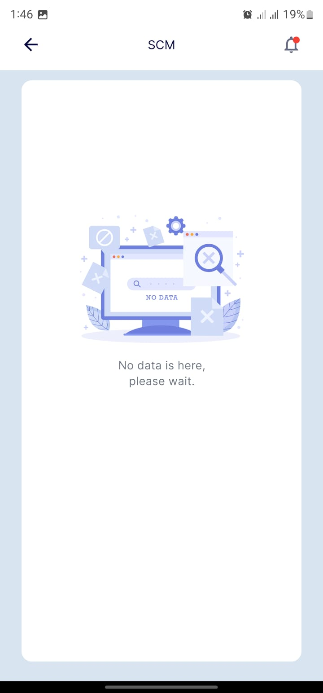
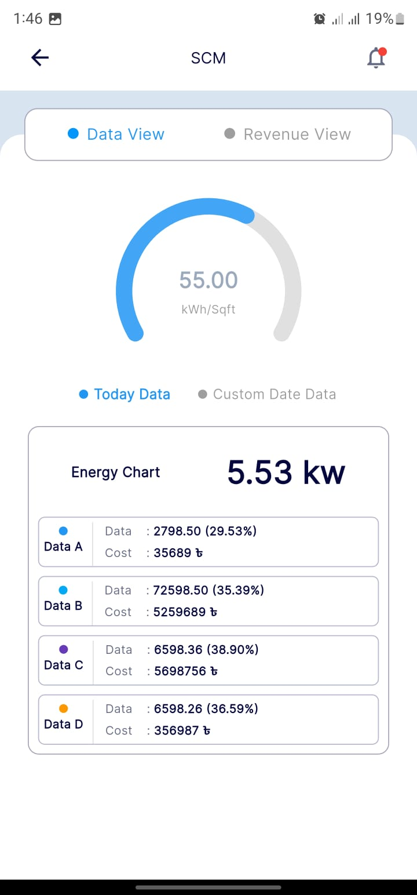
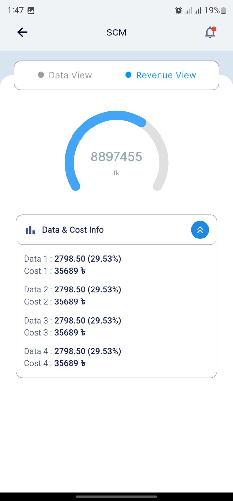
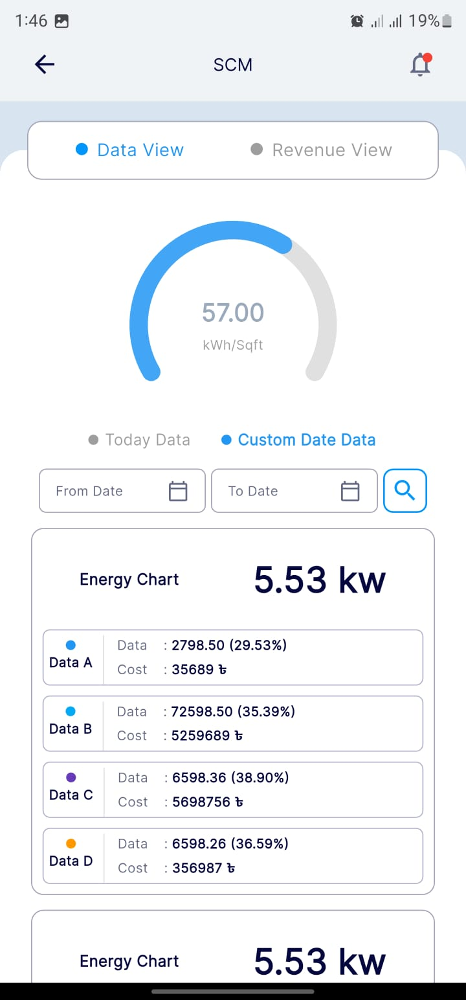

# scube_task_app

👤 Author

Talha Ismail
Flutter Developer [ talha.ismail2119@gmail.com]

# 🚀  Scube Control And Monitoring System Dashboard

A clean, scalable, and responsive Flutter application developed as a **technical assessment task for Scube Technologies Ltd**.  
The app focuses on structured UI, maintainable architecture, and real-world usability.

---

## ✨ Key Features
- Fully responsive UI for multiple screen sizes
- Modular & clean architecture
- API-ready data layer
- Pixel-aligned UI implementation
- Reusable and scalable widget structure


## 📱 Application Screens

<p align="center">
  
  
  
</p>

<p align="center">
  
  
  
</p>

<p align="center">
  
</p>

---

## 🛠 Technology Stack
- **Flutter** – UI development
- **Dart** – Programming language
- **REST API** – Data communication
- **Responsive Layout** – Adaptive UI design

---

## 📦 Project Setup

```bash
flutter pub get
flutter run
